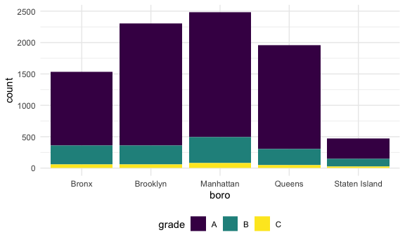
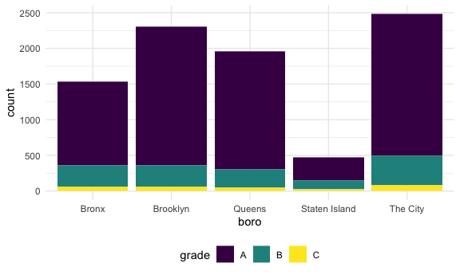
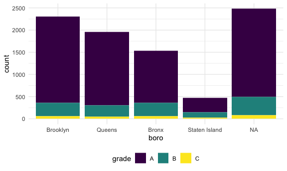
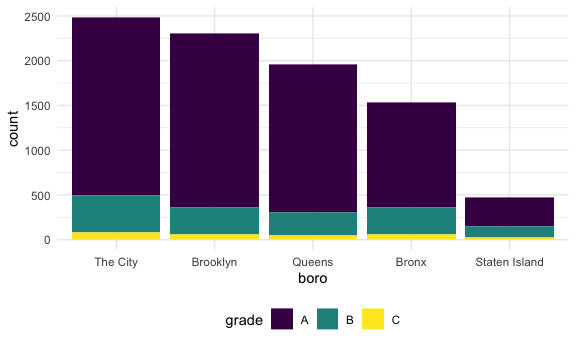

strings and factors
================

``` r
library(tidyverse)
```

    ## ── Attaching packages ─────────────────────────────────────── tidyverse 1.3.1 ──

    ## ✓ ggplot2 3.3.5     ✓ purrr   0.3.4
    ## ✓ tibble  3.1.4     ✓ dplyr   1.0.7
    ## ✓ tidyr   1.1.3     ✓ stringr 1.4.0
    ## ✓ readr   2.0.1     ✓ forcats 0.5.1

    ## ── Conflicts ────────────────────────────────────────── tidyverse_conflicts() ──
    ## x dplyr::filter() masks stats::filter()
    ## x dplyr::lag()    masks stats::lag()

``` r
library(rvest)
```

    ## 
    ## Attaching package: 'rvest'

    ## The following object is masked from 'package:readr':
    ## 
    ##     guess_encoding

``` r
library(httr)
library(p8105.datasets)

knitr::opts_chunk$set(
  fig.width = 6, 
  fig.asp = .6, 
  out.width = "90%"
)


theme_set(theme_minimal() + theme(legend.position = "bottom"))

options(
  ggplot2.continuous.colour = "viridis",
  ggplot2.continuous.fill = "viridis"
)

scale_colour_discrete = scale_colour_viridis_d
scale_fill_discrete = scale_fill_viridis_d
```

## String vectors

``` r
string_vec = c("my", "name", "is", "jeff")

str_detect(string_vec, "m")
```

    ## [1]  TRUE  TRUE FALSE FALSE

``` r
str_detect(string_vec, "jeff")
```

    ## [1] FALSE FALSE FALSE  TRUE

``` r
str_replace(string_vec, "jeff", "Jeff")
```

    ## [1] "my"   "name" "is"   "Jeff"

``` r
str_replace(string_vec, "jeff", "")
```

    ## [1] "my"   "name" "is"   ""

``` r
str_replace(string_vec, "e", "This is an uppercase E")
```

    ## [1] "my"                        "namThis is an uppercase E"
    ## [3] "is"                        "jThis is an uppercase Eff"

``` r
string_vec = c(
  "i think we all rule for participating",
  "i think i have been caught",
  "i think this will be quite fun actually",
  "it will be fun, i think"
  )

str_detect(string_vec, "i think")
```

    ## [1] TRUE TRUE TRUE TRUE

``` r
str_detect(string_vec, "i think$")
```

    ## [1] FALSE FALSE FALSE  TRUE

^ = the beggining of a line (first thing in the line) $ = at the end,
NOT the first thing in the line

``` r
string_vec = c(
  "Y'all remember Pres. HW Bush?",
  "I saw a green bush",
  "BBQ and Bushwalking at Molonglo Gorge",
  "BUSH -- LIVE IN CONCERT!!"
  )

str_detect(string_vec, "bush")
```

    ## [1] FALSE  TRUE FALSE FALSE

``` r
str_detect(string_vec, "Bush")
```

    ## [1]  TRUE FALSE  TRUE FALSE

``` r
str_detect(string_vec, "[Bb]ush")
```

    ## [1]  TRUE  TRUE  TRUE FALSE

\[\] = upper or lowercase works

``` r
string_vec = c(
  '7th inning stretch',
  '1st half soon to begin. Texas won the toss.',
  'she is 5 feet 4 inches tall',
  '3AM - cant sleep :('
  )

str_detect(string_vec, "[0-9][a-zA-Z]")
```

    ## [1]  TRUE  TRUE FALSE  TRUE

Everything 0-9 in the first digit and then any upper/ lowercase letters

``` r
string_vec = c(
  'Its 7:11 in the evening',
  'want to go to 7-11?',
  'my flight is AA711',
  'NetBios: scanning ip 203.167.114.66'
  )

str_detect(string_vec, "7.11")
```

    ## [1]  TRUE  TRUE FALSE  TRUE

. = ANYTHING; 7 followed by literally anything and then 11 - that’s what
we want

``` r
string_vec = c(
  'The CI is [2, 5]',
  ':-]',
  ':-[',
  'I found the answer on pages [6-7]'
  )

str_detect(string_vec, "\\[")
```

    ## [1]  TRUE FALSE  TRUE  TRUE

Square brackets and . have special meanings in regular expressions, so
searching for those is a little tough

If you’re ACTUALLY looking for a square bracket, you need to add a
backslash, but backslash is a special character, so you have to put 2 of
them

## Why factors are weird

``` r
factor_vec = factor(c("male", "male", "female", "female"))
```

-   you didn’t tell me which was the reference cat, so it goes
    alphabetically

``` r
as.numeric(factor_vec)
```

    ## [1] 2 2 1 1

-   converts to underlying numbers

``` r
factor_vec = fct_relevel(factor_vec, "male")
```

## NSDUH

``` r
nsduh_url = "http://samhda.s3-us-gov-west-1.amazonaws.com/s3fs-public/field-uploads/2k15StateFiles/NSDUHsaeShortTermCHG2015.htm"

table_marj =
  read_html(nsduh_url) %>% 
  html_table() %>% 
  first() %>% 
  slice(-1)
```

-   Presence of the a = character variable; lots of untidyness

Let’s clean it up

``` r
table_marj %>% 
  select(-contains("P value")) %>% 
  pivot_longer(
    -State, 
    names_to = "age_year", 
    values_to = "percent") %>% 
  separate(age_year, into = c("age", "year"), -11)
```

    ## # A tibble: 560 × 4
    ##    State      age   year        percent
    ##    <chr>      <chr> <chr>       <chr>  
    ##  1 Total U.S. 12+   (2013-2014) 12.90a 
    ##  2 Total U.S. 12+   (2014-2015) 13.36  
    ##  3 Total U.S. 12-17 (2013-2014) 13.28b 
    ##  4 Total U.S. 12-17 (2014-2015) 12.86  
    ##  5 Total U.S. 18-25 (2013-2014) 31.78  
    ##  6 Total U.S. 18-25 (2014-2015) 32.07  
    ##  7 Total U.S. 26+   (2013-2014) 9.63a  
    ##  8 Total U.S. 26+   (2014-2015) 10.25  
    ##  9 Total U.S. 18+   (2013-2014) 12.87a 
    ## 10 Total U.S. 18+   (2014-2015) 13.41  
    ## # … with 550 more rows

``` r
marj_df = 
  table_marj %>% 
  select(-contains("P value")) %>% 
  pivot_longer(
    -State, 
    names_to = "age_year", 
    values_to = "percent") %>% 
  separate(age_year, into = c("age", "year"), "\\(") %>% 
  mutate(
    year = str_replace(year, "\\)", ""), 
    percent = str_replace(percent, "[a-c]$", ""), 
    percent = as.numeric(percent)
  ) %>% 
  filter(!(State %in% c("Total U.S.", "Northeast", "Midwest", "South", "West")))
```

Do dataframe stuff

``` r
marj_df %>% 
  filter(age == "12-17") %>% 
  mutate(
    State = fct_reorder(State, percent)
  ) %>% 
  ggplot(aes(x = State, y = percent, color = year)) + 
  geom_point() +
  theme(axis.text.x = element_text(angle = 90, vjust = 0.5, hjust = 1))
```


## Restaurant Inspections

``` r
data("rest_inspec")
rest_inspec
```

    ## # A tibble: 397,584 × 18
    ##    action        boro   building   camis critical_flag cuisine_descrip… dba     
    ##    <chr>         <chr>  <chr>      <int> <chr>         <chr>            <chr>   
    ##  1 Violations w… MANHA… 425       4.15e7 Not Critical  Italian          SPINELL…
    ##  2 Violations w… MANHA… 37        4.12e7 Critical      Korean           SHILLA …
    ##  3 Violations w… MANHA… 15        4.11e7 Not Critical  Café/Coffee/Tea CITY PE…
    ##  4 Violations w… MANHA… 35        4.13e7 Critical      Korean           MADANGS…
    ##  5 Violations w… MANHA… 1271      5.00e7 Critical      American         THE HAR…
    ##  6 Violations w… MANHA… 155       5.00e7 Not Critical  Donuts           DUNKIN …
    ##  7 Violations w… MANHA… 1164      5.00e7 Critical      Salads           SWEETGR…
    ##  8 Violations w… MANHA… 37        4.12e7 Not Critical  Korean           SHILLA …
    ##  9 Violations w… MANHA… 299       5.01e7 Not Critical  American         PRET A …
    ## 10 Violations w… MANHA… 53        4.04e7 Not Critical  Korean           HAN BAT…
    ## # … with 397,574 more rows, and 11 more variables: inspection_date <dttm>,
    ## #   inspection_type <chr>, phone <chr>, record_date <dttm>, score <int>,
    ## #   street <chr>, violation_code <chr>, violation_description <chr>,
    ## #   zipcode <int>, grade <chr>, grade_date <dttm>

rest\_inspec %&gt;% slice(1:100) %&gt;% view() (how to look at things)

``` r
rest_inspec %>% 
  janitor::tabyl(boro, grade)
```

    ##           boro     A     B    C Not Yet Graded   P    Z   NA_
    ##          BRONX 13688  2801  701            200 163  351 16833
    ##       BROOKLYN 37449  6651 1684            702 416  977 51930
    ##      MANHATTAN 61608 10532 2689            765 508 1237 80615
    ##        Missing     4     0    0              0   0    0    13
    ##         QUEENS 35952  6492 1593            604 331  913 45816
    ##  STATEN ISLAND  5215   933  207             85  47  149  6730

``` r
rest_inspec = 
  rest_inspec %>% 
  filter(
    str_detect(grade, "[ABC]"), 
   !(boro == "Missing")) %>% 
  mutate(boro = str_to_title(boro))

rest_inspec %>% 
  filter(str_detect(dba, "[Pp][Ii][Zz][Zz][Aa]")) %>% 
  ggplot(aes(x = boro, fill = grade)) + 
  geom_bar()
```



``` r
rest_inspec %>% 
  filter(str_detect(dba, "[Pp][Ii][Zz][Zz][Aa]")) %>% 
  mutate(
    boro = fct_infreq(boro)
  ) %>% 
  ggplot(aes(x = boro, fill = grade)) + 
  geom_bar()
```


What about changing a label…

``` r
rest_inspec %>% 
  filter(str_detect(dba, "[Pp][Ii][Zz][Zz][Aa]")) %>% 
  mutate(
    boro = fct_infreq(boro), 
    boro = str_replace(boro, "Manhattan", "The City")
  ) %>% 
  ggplot(aes(x = boro, fill = grade)) + 
  geom_bar()
```



This worked, but undid the factor

``` r
rest_inspec %>% 
  filter(str_detect(dba, "[Pp][Ii][Zz][Zz][Aa]")) %>% 
  mutate(
    boro = fct_infreq(boro), 
    boro = replace(boro, which(boro == "Manhattan"), "The City")
  ) %>% 
  ggplot(aes(x = boro, fill = grade)) + 
  geom_bar()
```

    ## Warning in `[<-.factor`(`*tmp*`, list, value = "The City"): invalid factor
    ## level, NA generated



If you’re dealing with factors and you want to change the labels, it’s
annoying

``` r
rest_inspec %>% 
  filter(str_detect(dba, "[Pp][Ii][Zz][Zz][Aa]")) %>% 
  mutate(
    boro = fct_infreq(boro), 
    boro = fct_recode(boro, "The City" = "Manhattan")
  ) %>% 
  ggplot(aes(x = boro, fill = grade)) + 
  geom_bar()
```


